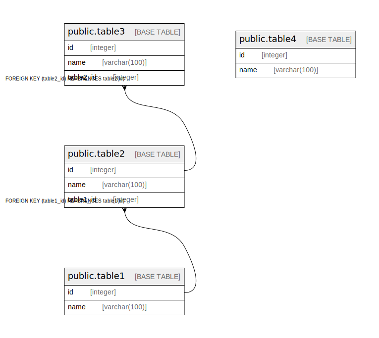

# postgres

## Tables

| Name | Columns | Comment | Type |
| ---- | ------- | ------- | ---- |
| [public.table1](public.table1.md) | 2 |  | BASE TABLE |
| [public.table2](public.table2.md) | 3 |  | BASE TABLE |
| [public.table3](public.table3.md) | 3 |  | BASE TABLE |
| [public.table4](public.table4.md) | 2 |  | BASE TABLE |

## Relations

---

> Generated by [tbls](https://github.com/k1LoW/tbls)
