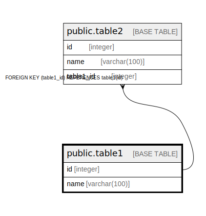

# public.table1

## Description

## Columns

| Name | Type | Default | Nullable | Children | Parents | Comment |
| ---- | ---- | ------- | -------- | -------- | ------- | ------- |
| id | integer | nextval('table1_id_seq'::regclass) | false | [public.table2](public.table2.md) |  |  |
| name | varchar(100) |  | true |  |  |  |

## Constraints

| Name | Type | Definition |
| ---- | ---- | ---------- |
| table1_pkey | PRIMARY KEY | PRIMARY KEY (id) |

## Indexes

| Name | Definition |
| ---- | ---------- |
| table1_pkey | CREATE UNIQUE INDEX table1_pkey ON public.table1 USING btree (id) |

## Relations

---

> Generated by [tbls](https://github.com/k1LoW/tbls)
