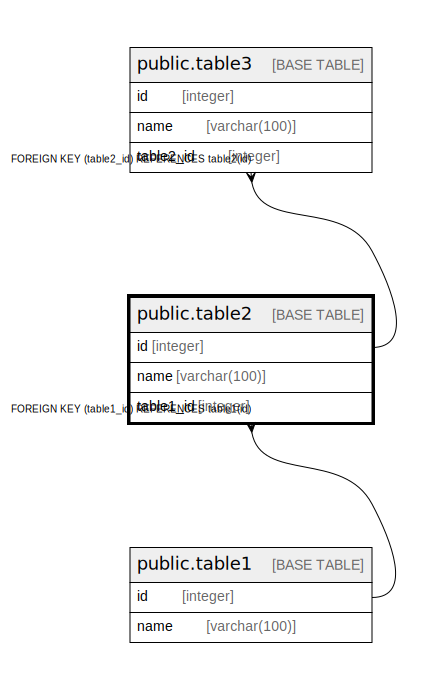

# public.table2

## Description

## Columns

| Name | Type | Default | Nullable | Children | Parents | Comment |
| ---- | ---- | ------- | -------- | -------- | ------- | ------- |
| id | integer | nextval('table2_id_seq'::regclass) | false | [public.table3](public.table3.md) |  |  |
| name | varchar(100) |  | true |  |  |  |
| table1_id | integer |  | true |  | [public.table1](public.table1.md) |  |

## Constraints

| Name | Type | Definition |
| ---- | ---- | ---------- |
| table2_table1_id_fkey | FOREIGN KEY | FOREIGN KEY (table1_id) REFERENCES table1(id) |
| table2_pkey | PRIMARY KEY | PRIMARY KEY (id) |

## Indexes

| Name | Definition |
| ---- | ---------- |
| table2_pkey | CREATE UNIQUE INDEX table2_pkey ON public.table2 USING btree (id) |

## Relations

---

> Generated by [tbls](https://github.com/k1LoW/tbls)
