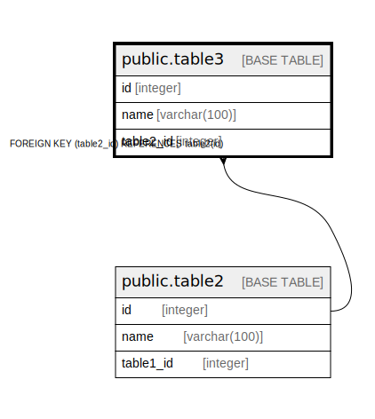

# public.table3

## Description

## Columns

| Name | Type | Default | Nullable | Children | Parents | Comment |
| ---- | ---- | ------- | -------- | -------- | ------- | ------- |
| id | integer | nextval('table3_id_seq'::regclass) | false |  |  |  |
| name | varchar(100) |  | true |  |  |  |
| table2_id | integer |  | true |  | [public.table2](public.table2.md) |  |

## Constraints

| Name | Type | Definition |
| ---- | ---- | ---------- |
| table3_table2_id_fkey | FOREIGN KEY | FOREIGN KEY (table2_id) REFERENCES table2(id) |
| table3_pkey | PRIMARY KEY | PRIMARY KEY (id) |

## Indexes

| Name | Definition |
| ---- | ---------- |
| table3_pkey | CREATE UNIQUE INDEX table3_pkey ON public.table3 USING btree (id) |

## Relations

---

> Generated by [tbls](https://github.com/k1LoW/tbls)
